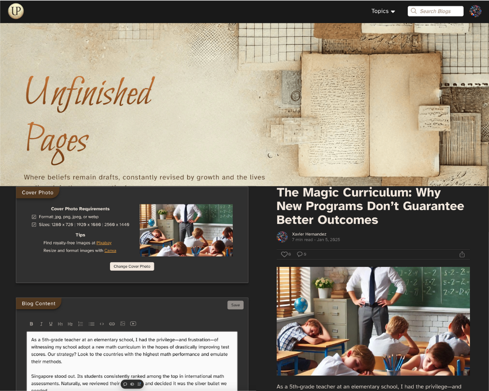

# Unfinished Pages

Unfinished Pages is a dynamic blogging platform built using TypeScript, Next.js, Postgres, Prisma, and NextAuth. The platform provides a seamless experience for users to log in, comment, and interact with blogs. Users can also request to become authors and create their own blogs using a custom-built text editor powered by Slate.js. Additionally, blogs are automatically SEO-optimized to enhance visibility and engagement.

## Features

- **User Authentication**: Secure login and registration with NextAuth.
- **Blogging Platform**: Authors can create, edit, and manage their blogs.
- **Custom Text Editor**: Powered by Slate.js, offering rich text editing for blog creation.
- **SEO Optimization**: Blogs are automatically optimized for search engines.
- **Commenting System**: Users can comment on blogs and reply to comments.
- **Email Notifications**: Users receive notifications for engagement in their blogs and comments.
- **Image Storage**: All images are securely stored in an Amazon S3 bucket.

## Tech Stack

- **Frontend**: TypeScript, Next.js
- **Backend**: Postgres, Prisma, NextAuth
- **Text Editor**: Slate.js
- **Image Storage**: Amazon S3
- **Authentication**: NextAuth
- **SEO**: Automatic SEO optimization

